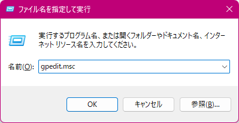
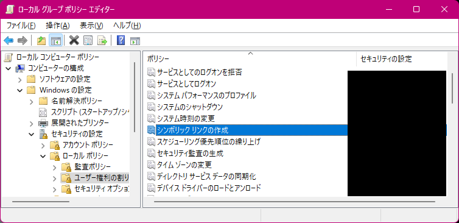
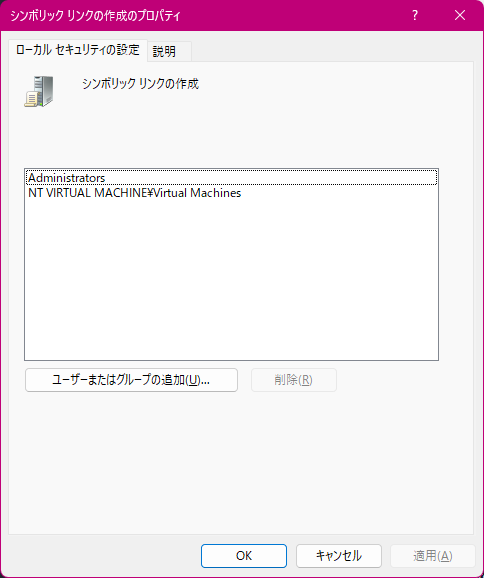
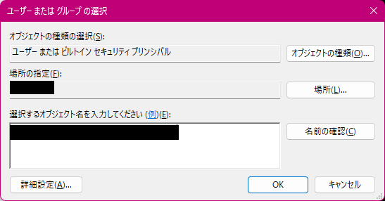
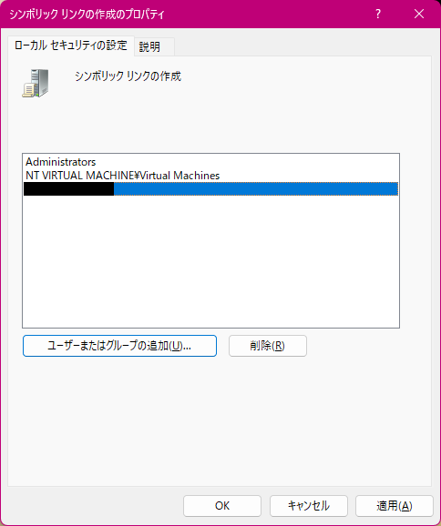

---
tags:
  - Windows
  - Configurations
---

# Create symlink as Non-Admin User

Windows では、 `mklink` コマンドでシンボリックリンクを作成しようとしても、
Windows のローカルポリシーで管理者権限以外のユーザによる
シンボリックリンクの作成を行うことはできない。

都度、管理者権限でターミナルを起動するのは面倒なので、
以下の手順でシンボリックリンクの作成を許可しておくと便利。

1.  ++win+r++ を押して、「ファイル名を指定して実行」ダイアログを開く

1.  `gpedit.msc` と入力して ++enter++ を押す  
    「Microsoft 管理コンソール」起動に関する確認ダイアログは「はい」を選ぶ

    

1.  左側のペインで「ローカル コンピューター ポリシー」→「コンピューターの構成」→「Windows の設定」
    →「セキュリティの設定」→「ローカル ポリシー」→「ユーザ権利の割り当て」を選び、
    右側のペインの「シンボリック リンクの作成」をダブルクリックする

    

1.  「ユーザまたはグループの追加」ボタンを押す

    

1.  ユーザ名を入力して「名前の確認」ボタンを押してから「OK」ボタンを押す

    

1.  「シンボリック リンクの作成」ダイアログにも、
    先ほど入力したユーザ名が追加されていることが確認できたら「OK」ボタンを押す

    

1.  Windows を再起動をすれば、ターミナルを管理者権限で開かなくても、シンボリックリンクが作成できるようになっているはず
