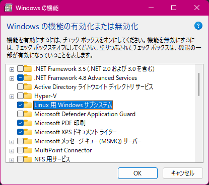

---
tags:
  - Windows
  - WSL
---

# Install WSL2

!!! info

    WSL の詳しいことは[公式ドキュメント](https://learn.microsoft.com/ja-jp/windows/wsl/install)参照

Windows 11 になってからずいぶんと WSL2 のインストールが簡単になったのでメモ。流れは以下の通り。

1.  Windows の機能から、以下の2つを有効にして再起動する
    * Linux 用 Windows サブシステム
    * 仮想マシン プラットフォーム

2.  WSL2 をデフォルトに設定し、 WSL と Ubuntu をインストールする


## Windows 機能の有効化

1.  ++win+r++ を押して、「ファイル名を指定して実行」ダイアログを開く

1.  `powershell` と入力して ++ctrl+shift+enter++ を押す  
    (管理者モードで PowerShell プロンプトを開く)

    「Windows Powershell」起動に関する確認ダイアログは「はい」を選ぶ

1.  以下のコマンドを実行して、「Linux 用 Windows サブシステム」と「仮想マシン プラットフォーム」を有効にする

    ``` .ps1 title="「Linux 用 Windows Subsystem」を有効化"
    dism.exe /Online /Enable-Feature /FeatureName:Microsoft-Windows-Subsystem-Linux /All /NoRestart
    ```

    ``` .ps1 title="「仮想マシン プラットフォーム」を有効化"
    dism.exe /Online /Enable-Feature /FeatureName:VirtualMachinePlatform /All /NoRestart
    ```

1.  Windows を再起動する

??? info "コマンドラインではなく、 GUI で設定する場合"

    1.  以下のいずれかで「Windows の機能の有効化または無効化」画面を開く

        * `コントロール パネル\プログラム\プログラムと機能\` から開く

        *   2.  ++win+r++ を押して、「ファイル名を指定して実行」ダイアログを開いて

            2.  `OptionalFeatures.exe` と入力して ++enter++ を押す

    1.  以下のような画面が開くので、「Linux 用 Windows サブシステム」と「仮想マシン プラットフォーム」を有効にする  
        


## WSL のインストール

1.  ++win+r++ を押して、「ファイル名を指定して実行」ダイアログを開く

1.  `powershell` と入力して ++ctrl+shift+enter++ を押す  
    (管理者モードで PowerShell プロンプトを開く)

    「Windows Powershell」起動に関する確認ダイアログは「はい」を選ぶ

1.  以下のコマンドを実行して、 WSL2 をデフォルトに設定する

    ``` .ps1 title="WSL2 をデフォルトに設定"
    wsl.exe --set-default-version 2
    ```

1.  以下のコマンドを実行して、Ubuntu をインストールする

    ``` .ps1 title="Ubuntu のインストール"
    wsl.exe --install -d Ubuntu
    ```

    !!! info "インストール可能なディストリビューション名を確認するには"

        以下のコマンドで、インストールに指定可能なディストリビューション名を確認できる

        ``` .ps title="インストール可能なディストリビューションの確認方法"
        wsl.exe -l --online
        ```
